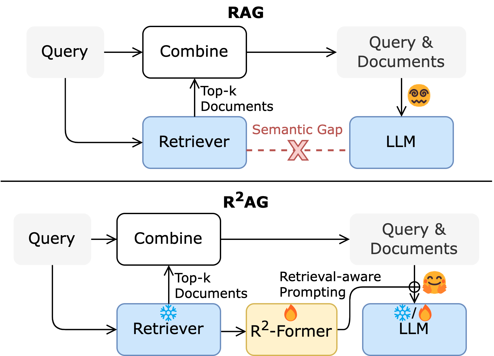

# R$`^2`$AG: Incorporating Retrieval Information into Retrieval Augmented Generation
The official Github repository for paper [R$`^2`$AG]() (EMNLP 2024 Findings).



## Abstract
Retrieval augmented generation (RAG) has been applied in many scenarios to augment large language models (LLMs) with external documents provided by retrievers. However, a semantic gap exists between LLMs and retrievers due to differences in their training objectives and architectures. This misalignment forces LLMs to passively accept the documents provided by the retrievers, leading to incomprehension in the generation process, where the LLMs are burdened with the task of distinguishing these documents using their inherent knowledge. This paper proposes R$`^2`$AG, a novel enhanced RAG framework to fill this gap by incorporating **R**etrieval information into **R**etrieval **A**ugmented **G**eneration. Specifically, R$`^2`$AG utilizes the nuanced features from the retrievers and employs a R$`^2`$-Former to capture retrieval information. Then, a retrieval-aware prompting strategy is designed to integrate retrieval information into LLMs' generation. Notably, R$`^2`$AG suits low-source scenarios where LLMs and retrievers are frozen. Extensive experiments across five datasets validate the effectiveness, robustness, and efficiency of R$`^2`$AG. Our analysis reveals that retrieval information serves as an anchor to aid LLMs in the generation process, thereby filling the semantic gap.

## Quick Start
This guide will walk you through processing datasets and training in R$`^2`$AG framework with datasets like [NQ](https://ai.google.com/research/NaturalQuestions/), [HotpotQA](https://hotpotqa.github.io), [MuSiQue](https://allenai.org/data/musique), [2WikiMultiHopQA](https://github.com/Alab-NII/2wikimultihop?tab=readme-ov-file), and [DuReader](https://huggingface.co/datasets/yanbingzheng/LongBench).

### Prepare the code and environment
Git clone our repository and install following packages.
```
torch==2.1.2
transformers==4.40.2
sentence-transformers==2.6.1
trl==0.8.1
peft==0.10.0
```

### Dataset Preparation
For NQ datasets, download from the repository of [lost-in-the-middle](https://github.com/nelson-liu/lost-in-the-middle/tree/main/qa_data). As the [LongBench version of DuReader](https://huggingface.co/datasets/yanbingzheng/LongBench) does not include labels for relevant documents, you can download the [raw version of DuReader](https://aistudio.baidu.com/datasetdetail/88466) and follow the instructions in [label_dureader.ipynb](retrieval/label_dureader.ipynb) to generate the labels. Alternatively, download the preprocessed .pkl file directly from [here](https://drive.google.com/file/d/1rVeFZi9SVHJ59VU8MZUIeui9gwZP2WBp/view?usp=share_link). Other datasets refer their official websites.

### (Optional) Fine-tune a Retriever
To directly improve RAG performance, you can fine-tune a retriever using [retrieval/finetune_retriever.py](retrieval/finetune_retriever.py). This step is optional but recommended for achieving optimal results of R$`^2`$AG. Here we fine-tune a BERT using SentenceTransformer.
```bash
cd retrieval
python finetune_retriever.py \
    --dataset_name nq_10 \
    --input_path 10_total_documents/nq-open-10_total_documents_gold_at_0.jsonl.gz \
    --model_name google-bert/bert-base-uncased \
    --train_batch_size 32 \
    --num_epoch 4
```
where
- `dataset_name`: The name of dataset to be used.
- `input_path`: The file path of dataset.
- `model_name`: The retriever model name or path to be fine-tuned.
The finetuned retriever model will be saved in the `retrieval/retrievers` folder. For HotpotQA, MuSiQue, 2Wiki datasets, please use `train_data_path` and `test_data_path`. Detailed commands are available in [scripts/retriever](scripts/retriever) folder.

### Rank and extract features with a retriever
Before training, it is need to extract retrieval features from the retriever. You have the flexibility to select the fine-tuned or non-trained retrieval model, such as `google-bert/bert-base-uncased`, `BAAI/bge-reranker-large`, `facebook/contriever`.
For NQ datasets:
```bash
cd retrieval
python feature_extraction.py \
    --dataset_name nq_10 \
    --input_path 10_total_documents/nq-open-10_total_documents_gold_at_0.jsonl.gz \
    --save_path dataset/nq-open-10_total_documents_gold_at_0_bert.pkl \
    --model_name google-bert/bert-base-uncased
```
where
- `save_path`: The file path to save new dataset, typically is a .pkl file.
- `model_name`: The name or path of retriever (fine-tuned or non-finetuned).

For HotpotQA, 2Wiki and MuSiQue datasets, refer to the [scripts/feature_extraction](scripts/feature_extraction) folder for specific commands.

Besides, you can get retrieval features from OpenAI Embedding using [retrieval/feature_extraction_openai.py](retrieval/feature_extraction_openai.py). Ensure you configure the `base_url` and `api_key` in the script at Lines 38-39 before execution.
```bash
cd retrieval
python feature_extraction_openai.py \
    --dataset_name nq_10 \
    --input_path 10_total_documents/nq-open-10_total_documents_gold_at_0.jsonl.gz \
    --model_name text-embedding-3-large \
    --emb_save_path dataset/nq_10_openai_embedding_large.pkl \
    --dataset_save_path dataset/nq-open-10_total_documents_gold_openai_large.pkl
```
where
- `emb_save_path`: The .pkl file path to save embeddings.
- `dataset_save_path`: The .pkl file path to save dataset.

### Train R$`^2`$AG
[runner.py](runner.py) is the central script for training, generation and evaluation. You can train R$`^2`$-Former by:
```bash
python runner.py \
    --dataset_name nq_10 \
    --input_path retrieval/dataset/nq-open-10_total_documents_gold_at_0_bert.pkl \
    --model_name meta-llama/Llama-2-7b-hf \
    --use_training\
    --save_model \
    --output_dir output/rrag/Rrag-Llama-2-7b \
    --freeze_llm \
    --num_k 10 \
    --use_rrag \
    --use_evaluation \
    --save_results
```
where
- `input_path`: The file path to the pre-processed dataset, typically a .pkl file containing retrieval features.
- `model_name`: The name or path of the LLM used for training. This can be a model from Hugging Face's model hub or a local path to a model file.
- `use_training`: Enables the training mode in the script.
- `save_model`: If set, the trained model will be saved to `output_dir`. 
- `output_dir`: The directory to save model. 
- `freeze_llm`: If set, this freezes the parameters of the LLM during training.
- `num_k`: Specifies the number of top documents. 
- `use_rrag`: Enables the use of R$`^2`$AG.
- `use_evaluation`: Enables the evaluation mode.
- `save_results`: If set, results from generation will be saved to `output` folder.

You can customize selecting different Large Language Models (LLMs), datasets, and various other parameters. For example, you can get the standard RAG results by:
```bash
python runner.py \
    --dataset_name nq_10 \
    --input_path retrieval/dataset/nq-open-10_total_documents_gold_at_0_bert.pkl \
    --model_name meta-llama/Llama-2-7b-hf \
    --freeze_llm \
    --num_k 10 \
    --use_evaluation \
    --save_results
```
For HotpotQA, 2Wiki, and MuSiQue datasets, refer to the [scripts/train](scripts/train) folder for specific commands to train R$`^2`$AG.

